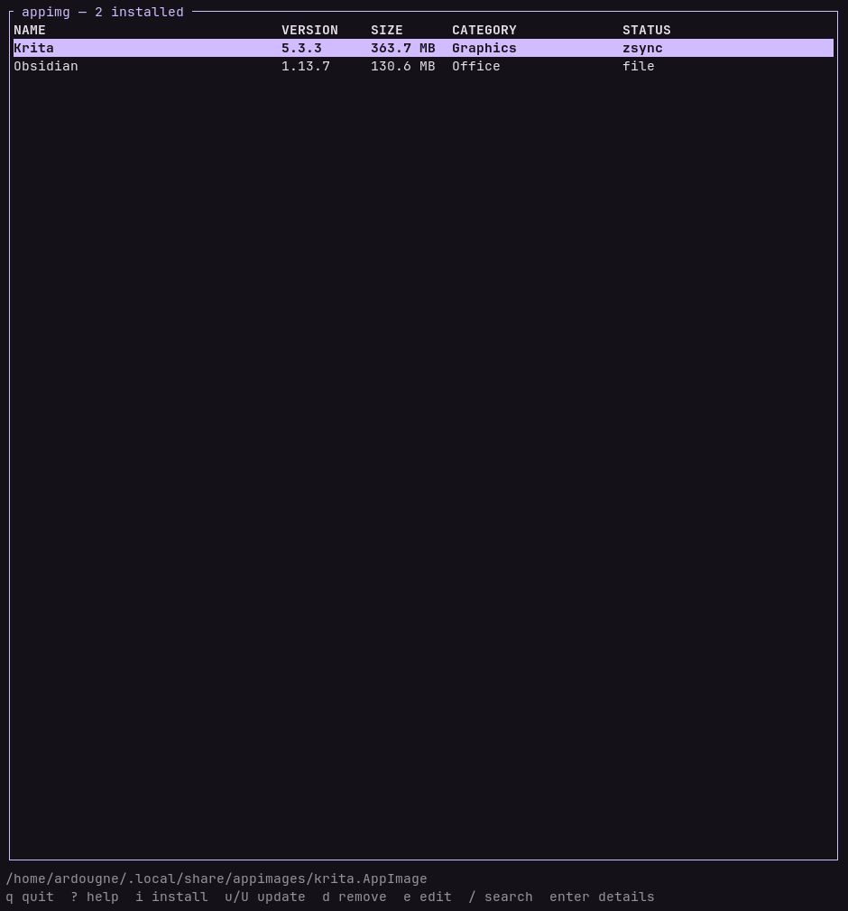

# appimg

Installs, updates and removes AppImages as proper desktop applications, entirely
inside `$HOME`.

## Install

Arch, from the AUR:

    yay -S appimg        # builds from source
    yay -S appimg-bin    # prebuilt binary

Anywhere else:

    cargo install appimg

Requires Rust 1.88.

## Usage

Run `appimg` without arguments for the TUI, or go straight to a command:

    appimg install ./someapp.AppImage
    appimg install https://example.com/someapp.AppImage
    appimg list --json
    appimg update --all --check
    appimg remove someapp
    appimg doctor

The entry is registered right away, though some launchers only read their
application list at startup.

## Updates

    appimg update --all --check    check without changing anything
    appimg update --all            download and replace

No extra tool is needed. An application whose update information names a zsync
file, either `zsync|<url>` or `gh-releases-zsync|...`, fetches only the parts
of the new version it does not already have and verifies the assembled file
before installing it. Every other source downloads the whole thing. Each
update says which it was and what it cost:

      reused 19054 of 46308 blocks, fetched 107.0 MB in 22 requests

## Where things go

    $XDG_DATA_HOME/appimages/<name>.AppImage      the binary
    $XDG_DATA_HOME/applications/<name>.desktop    the launcher entry
    $XDG_DATA_HOME/icons/hicolor/*/apps/          every icon size it found
